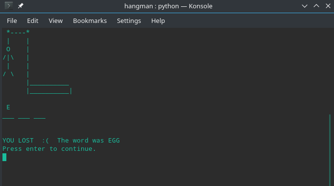

# Hangman (Ahorcado)

Python hangman CLI multilanguage in spanish and english.

(Uses internet for generating the words. Requires Python 3)

To execute:
python hangman.py

# Screenshots
Menu:

Game:

Losing:

